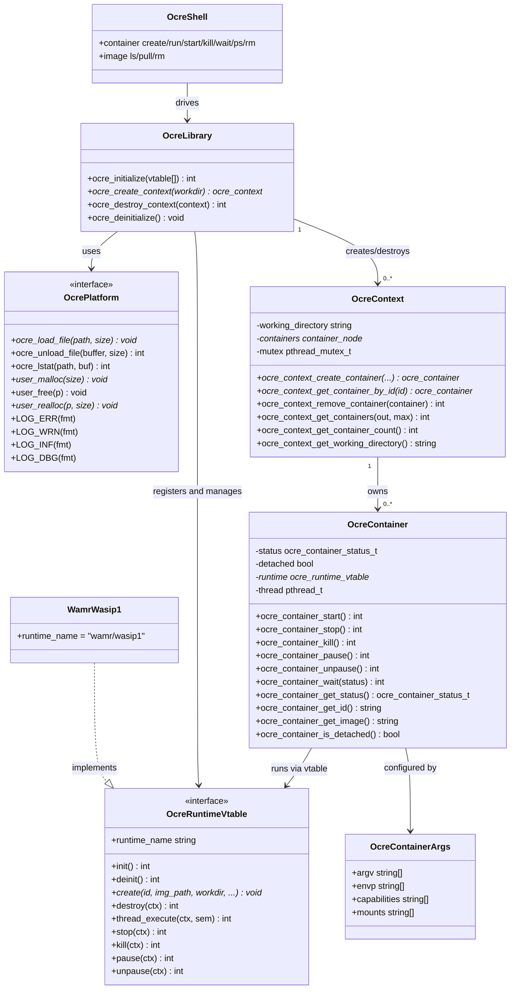
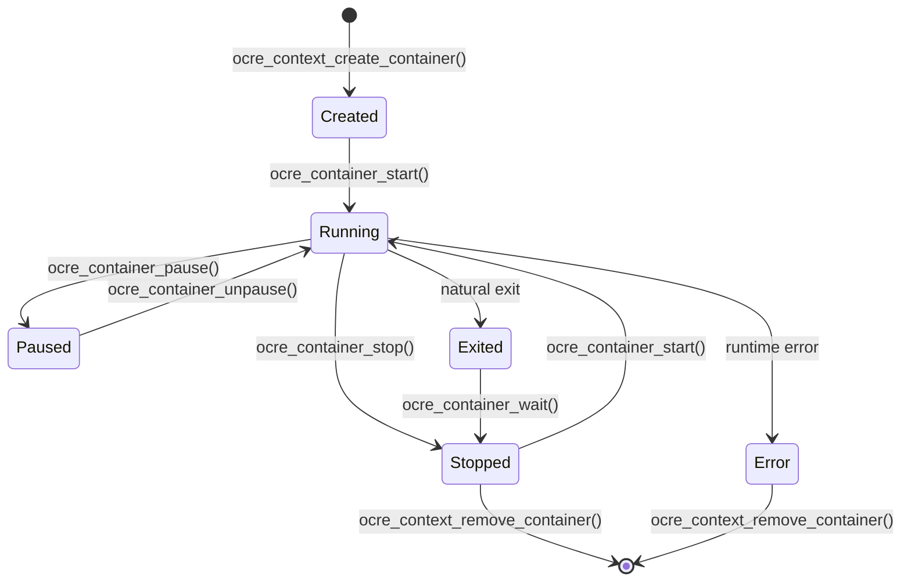

<!-- @copyright Copyright (c) contributors to Project Ocre,
which has been established as Project Ocre a Series of LF Projects, LLC

SPDX-License-Identifier: Apache-2.0 -->

# Design

Ocre is provided as a library to be included in other applications.

Some applications are provided as examples or templates. Please refer to each application's documentation for more information.

## Components

The Ocre library is divided into several components:

- **Ocre Common**: common code reused across Ocre components
- **Ocre Platform**: platform-specific code
  - Zephyr: platform-specific code for Zephyr systems
  - POSIX: platform-specific code for POSIX systems like Linux
- **Ocre Core**: the main Ocre library
  - Ocre Library (`ocre/library.h`): initialization and context lifecycle
  - Ocre Context (`ocre/context.h`): container management within a working directory
  - Ocre Container (`ocre/container.h`): individual container lifecycle
- **Ocre Shell**: the command-line interface for Ocre
- **Ocre Runtime**: the runtime engine interface (`ocre/runtime/vtable.h`) and built-in WAMR/WASI-P1 engine

These components and their relationships are described below:



### Ocre Common

The Ocre Common component provides common code reused across Ocre components, including version information (`version.h`) and commit ID (`commit_id.h`).

### Ocre Platform

The Ocre Platform component provides platform-specific implementations for POSIX and Zephyr, exposing a common interface to Ocre. It abstracts platform-specific functionality including binary file loading/mapping, memory allocation, logging, and configuration.

The platform must provide:

- **File I/O**: `ocre_load_file` / `ocre_unload_file` — load a binary image into memory (e.g. via `mmap` on POSIX, or `read` on Zephyr)
- **Memory**: `user_malloc` / `user_free` / `user_realloc` — application-level memory (supports tiered memory on Zephyr via `shared_multi_heap`)
- **Logging**: `LOG_ERR` / `LOG_WRN` / `LOG_INF` / `LOG_DBG` macros (Zephyr-style logging API)
- **Config**: `config.h` defining `CONFIG_OCRE_DEFAULT_WORKING_DIRECTORY` and other Kconfig-style options
- **lstat**: `ocre_lstat` — file metadata query

Check the [Ocre Platform](Platform.md), [Ocre Zephyr Platform](PlatformZephyr.md) and [Ocre POSIX Platform](PlatformPosix.md) documentation for more details.

### Ocre Core

The Ocre Core component is the main Ocre library. The public API is exposed through `<ocre/ocre.h>`, which aggregates:

- `<ocre/library.h>` — library init/deinit and context lifecycle
- `<ocre/context.h>` — container management within a context
- `<ocre/container.h>` — container lifecycle and inspection

#### Library

`ocre_initialize()` registers runtime engines (always includes the built-in WAMR/WASI-P1 engine, plus any user-supplied vtables), initializes them, and prepares global state. It must be called once before any other Ocre API.

`ocre_create_context()` creates a new context bound to a working directory (default: `CONFIG_OCRE_DEFAULT_WORKING_DIRECTORY`). Each working directory may only be used by one context at a time. The library ensures the `images/` and `containers/` subdirectories exist on creation.

`ocre_deinitialize()` destroys all contexts and deinitializes all registered runtimes.

#### Context

An Ocre context (`ocre_context`) manages a collection of containers within a working directory. The working directory has the following structure:

```
<workdir>/
├── images/       # WASM image files available for execution
└── containers/   # Per-container persistent storage (when "filesystem" capability is enabled)
```

Whenever a context is destroyed, all running containers are killed, all containers are waited on, and then all containers are removed. See [State Information](StateInformation.md) for more details.

#### Container

An Ocre container (`ocre_container`) is a lightweight, isolated process running on a runtime engine. Containers are created with a reference to an image file (looked up under `<workdir>/images/`), a runtime name, an optional ID, optional arguments (`ocre_container_args`), and optional I/O file descriptors.

`ocre_container_args` carries:

- `argv` — command-line arguments passed to the container entry point
- `envp` — environment variables (in `VAR=value` form)
- `capabilities` — feature flags (e.g. `"filesystem"`, `"networking"`, `"ocre:api"`)
- `mounts` — virtual mount points in `source:destination` form

An Ocre container can be in one of the following states:

- **Created**: The container has been created but not yet started.
- **Running**: The container is currently running and executing.
- **Paused**: The container has been paused and is not running.
- **Exited**: The container has exited but the exit code has not been collected yet (transient; resolved by `ocre_container_wait()`).
- **Stopped**: The container has been stopped and the exit code has been collected.
- **Error**: The container has encountered an error and is no longer available.



### Ocre Shell

The Ocre Shell component provides the command-line interface for Ocre. It allows the user to interact with Ocre containers through a simple command-line interface familiar to Docker users.

It is currently supported in Zephyr and is used by the [Supervisor sample](samples/supervisor.md).

Refer to the [Ocre Shell](OcreCli.md) documentation for more details.

### Ocre Runtime

The Ocre Runtime component defines the `ocre_runtime_vtable` interface (`<ocre/runtime/vtable.h>`), which is the plugin contract for custom runtime engines. The vtable includes function pointers for `init`, `deinit`, `create`, `destroy`, `thread_execute`, `stop`, `kill`, `pause`, and `unpause`.

The built-in runtime is **WAMR/WASI-P1** (`wamr/wasip1`), which uses the WebAssembly Micro-Runtime to execute WASM modules compiled against the WASI Preview 1 ABI. Additional runtime engines can be registered at initialization time via `ocre_initialize()`.

Refer to the [Custom Runtime Engine](CustomRuntimeEngine.md) documentation for more details.
